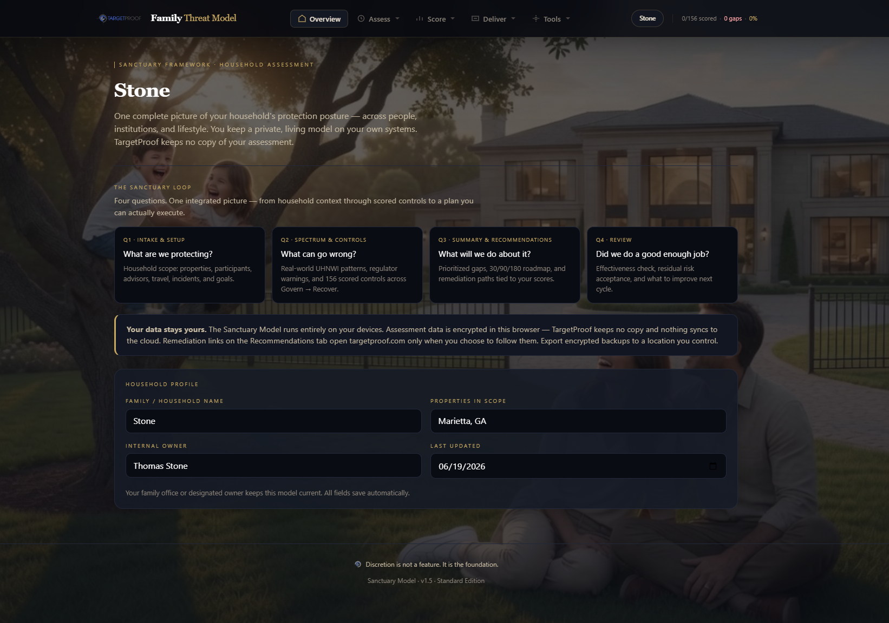

# Sanctuary Model

<p align="center">
  <a href="https://www.targetproof.com/model/">
    
  </a>
</p>

<p align="center"><em>Illustrative view — your household's model runs locally on your devices. TargetProof keeps no copy.</em></p>

**Standard Edition** — the on-device deliverable from the [Family Threat Model](https://www.targetproof.com/model/) engagement. Households and family offices map protection posture across people, institutions, and lifestyle using the 156-control Sanctuary Framework (NIST CSF 2.0: Govern → Recover). Everything runs on your devices. No cloud. No AI in this edition.

> **Discretion is not a feature. It is the foundation.**

[](LICENSE)

---

## License

Released under the **[MIT License](LICENSE)**. You may use, modify, and distribute this software — including for **commercial purposes** — without royalties or compensation to TargetProof. Keep the copyright notice and license text with any copy you redistribute.

**[Read the full disclaimer](DISCLAIMER.md)** before using this tool with clients or sensitive household data. The software is provided as-is, with no warranty and no guarantee of security outcomes.

---

## Who this is for

- **Practitioners** delivering the Family Threat Model to client households
- **Family offices** and estate teams maintaining a living protection posture record
- **Households** that want the full Sanctuary Loop without AI or external data connectors

This repository ships the **Standard Edition only**: guided Assistant (rule-based, no language model), full control catalog, intake, threat spectrum, recommendations, and encrypted local storage.

**AI Edition, Connected Edition, and fiduciary export integrations** are not in this repo — they ship through [TargetProof](https://www.targetproof.com/model/) engagements and stewardship programs.

---

## Quick start

### Windows
```bat
START.bat
```
Or:
```powershell
powershell -ExecutionPolicy Bypass -File .\start.ps1
```

### macOS
Double-click `START.command` (first time: right-click → Open).

### Linux
```bash
chmod +x start.sh start-server.sh
./start.sh
```

A local server opens at `http://127.0.0.1:8765/unlock.html`. **Keep the terminal window open** while working.

### First launch
1. **Create a vault password** (minimum 14 characters) — encrypts the assessment in this browser.
2. Complete **Overview** with household name and scope.
3. Work through the **Sanctuary Loop**: Intake → Spectrum → Controls → Roadmap → Review.
4. Use **Assistant** for guided answers from your scored data.

---

## What's in the model

| Section | Purpose |
|---------|---------|
| **Overview** | Household profile and Sanctuary Loop navigation |
| **Intake** | Properties, participants, travel, incidents, goals |
| **Spectrum** | NIST CSF mapping, FTC advisories, UHNWI threat patterns |
| **Controls** | 156 controls across Govern → Recover with gap scoring |
| **Recommendations** | Gaps linked to Sanctuary remediation services (optional, user-initiated) |
| **Summary** | Maturity dashboard, findings, 30 / 90 / 180-day roadmap |
| **Review** | Effectiveness and explicit residual-risk acceptance |
| **Assistant** | Guided Q&A from local model data only |
| **Your Data** | Encrypted export, import, lock, backups |

---

## Privacy and security

- **On-device only** — assessment data is encrypted in the browser vault (Web Crypto PBKDF2 + AES-GCM).
- **No telemetry** — TargetProof receives nothing from this tool.
- **Optional encrypted backups** — `.sanctuary.json` exports with a separate passphrase.
- **Local HTTP server** — binds to `127.0.0.1` only; path traversal blocked.
- **Content Security Policy** — scripts restricted to this origin.

Recommendation links open [targetproof.com/model](https://www.targetproof.com/model) only when the user clicks them.

---

## Backups

Use **Your Data → Download Backup** for a portable JSON export. For sensitive archives, use encrypted `.sanctuary.json` format with a dedicated export passphrase.

---

## Practitioner packaging

Publish the Standard Edition to `../targetproof-model`:

```powershell
.\publish-standard.ps1
```

---

## Assistant

The guided assistant answers from your scored intake, controls, and summary using structured, rule-based analysis — no language model, no cloud, no external connectors.

---

**v1.5** — Sanctuary Model · Standard Edition · [TargetProof](https://www.targetproof.com/model/)

Questions or practitioner inquiries: [hello@targetproof.com](mailto:hello@targetproof.com)